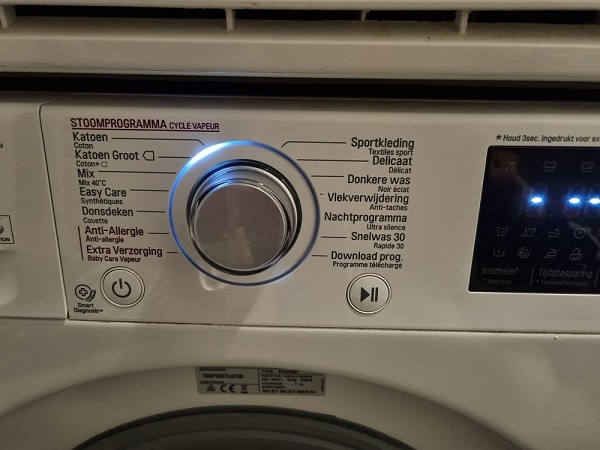

Guide to Krommerijn 8, Utrecht
==============

Dear guest(s),

<!---
Welcome to Krommerijn 8. I hope you have a nice stay in Utrecht. This guide will give you some additional information about my apartment and the surrounding area. If you have any questions, feel free to contact me via Airbnb or via WhatsApp (+31613151353). For emergencies, it may be better to call or WhatsApp my sister Carlijn (+31631144027) who lives nearby, as I will be outside the country.
-->

Welcome to Krommerijn 8. I hope you have a nice stay in Utrecht. This guide will give you some additional information about my apartment and the surrounding area. If you have any questions, feel free to contact me via Airbnb or by phone/WhatsApp (+31613151353). I will be staying just 10 minutes away on the other side of Utrecht.

All the best,

Laurens Bogaardt

 - [Check-In and -Out](#check-in-and--out)
 - [Toilet (!)](#toilet-)
 - [Coffee and Tea](#coffee-and-tea)
 - [Cleaning](#cleaning)
 - [Trash](#trash)
<!--- - [Heating](#heating) -->
 - [Washing and Drying](#washing-and-drying)
 - [Oven and Microwave](#oven-and-microwave)
 - [Dishwasher](#dishwasher)
 - [Books and Games](#books-and-games)
 - [WiFi](#wifi)
 - [Train Stations](#train-stations)
 - [Parking](#parking)
 - [Supermarket](#supermarket)
 - [Bars and Restaurants](#bars-and-restaurants)
 - [Nature Walks](#nature-walks)
 - [Architecture Walks](#architecture-walks)
 - [Bike Trips](#bike-trips)
 - [Museum](#museum)
 - [Canoe](#canoe)

# Check-In and -Out

<!---
I will hide the keys outside the apartment and will let you know the location in a private message. That way, you can enter independently. If there are any problems, you can ring the bell of my neighbours (for example Trudy on number 10) or call my sister Carlijn (+31631144027) who also lives in Utrecht. On the day of check-out, you can stay in the apartment until around 15:00. Let me know if you need to stay longer. When you leave, please put the keys back in the same hiding spot.
-->

I will meet you at my apartment to hand over the keys for the check-in. Simply ring the bell at number 8. On the day of check-out, you can stay in the apartment until around 15:00. Let me know if you need to stay longer. When you leave, please throw the keys in my mailbox.

# Toilet (!)

The button of the toilet sometimes gets stuck if you press too hard. When you pull the plastic cover towards you a bit, as in the first photo, the button should release again.

Toilet paper can be found in the closet behind the toilet.

# Coffee and Tea

Feel free to use the Nespresso coffee machine or the kettle to make tea. I will leave milk for the coffee in the fridge. Any other food and drinks in the apartment are my personal items and not intended for guests.

# Cleaning

It’s not necessary to clean my apartment extensively before you leave. I will clean when I get back home. But if you need anything, there is cleaning equipment in the cupboard.

# Trash

Utrecht separates paper and glass from all other trash. Regular trash goes in the left big bin, paper and cardboard goes in the right big bin.

Glass goes in the small bin.

<!---
# Heating

The heating automatically follows a programme which sets the temperature at 20° between 8:30-10:00 and between 17:00-23:00. It is 17.5° during the other times. If you want to change the temperature, the easiest way is to use the small arrows.

-->

# Washing and Drying

 - [Washer manual](./manuals/Washing Machine.pdf)
 - [Dryer manual](./manuals/Dryer.pdf)

Feel free to use the washing machine and the dryer. There is also detergent and an iron. The default programme “Katoen” is usually the best one and takes 1:36 hours to complete.

The default programme of the dryer is usually the best one and takes a maximum of 1:25 hours to complete but shorter if it senses that the clothes are dry.

# Oven and Microwave

 - [Oven and microwave manual](./manuals/Oven and Microwave.pdf)

The oven and microwave are the same machine. The easiest way to start the microwave is simply to press the ‘play’ button.

# Dishwasher

 - [Dishwasher manual](./manuals/Dishwasher.pdf)

There is no need to clean your dishes during your stay. You can simply place them in the sink or inside the dishwasher. I will turn on the dishwasher when I get back home. If you need it, the default programme “P1” is the best option and you can get a dishwasher tablet from the drawer on the right.

# Books and Games

Feel free to use my books and games.

# WiFi

For internet, select the WiFi named 'KrommerijnGuests'. I will send you the password in a private message.

# Train Stations

There are two train stations nearby; Utrecht Centraal is about a [20 minute walk](https://maps.app.goo.gl/WKPyBg3GZ6s4Kenx7) and Utrecht Vaartsche Rijn is only a [5 minute walk](https://maps.app.goo.gl/Dtb1sXQgPfhBtdkA7). From Vaartsche Rijn, you can take a 'sprinter' train to Utrecht Centraal but there is also a tram and bus service towards the main train station.

# Parking

There is parking right in front of the building, but I cannot guarantee that there is always a spot available. You can park anywhere in the area, though the price changes per neighbourhood. The prices per hour for each neighboorhood can be seen on this [map](https://gu-geo.maps.arcgis.com/apps/webappviewer/index.html?id=365c7b6926f74660b7322e646e8548dc). More information about parking in Utrecht can be found on the [website](https://www.utrecht.nl/wonen-en-leven/parkeren/parkeerkosten) of the city.

# Supermarket

The closest supermarket is Jumbo, which is just a few minutes walking: [https://maps.app.goo.gl/WCgqFtuvvzDRpsMG9](https://maps.app.goo.gl/WCgqFtuvvzDRpsMG9)

# Bars and Restaurants

There are many bars and restaurants everywhere in Utrecht, but the two main areas are around a place called ‘Neude’ in the north and around ‘Ledig Erf’ in the south, as highlighted on the map.

# Nature Walks

Unfortunately, we don’t have many parks in Utrecht, but there are a few nice places where you can find more green.

Short walk along the ‘Singel’ which used to be the old city-wall of Utrecht: [https://maps.app.goo.gl/BgTJ3fS5tDbivvm88](https://maps.app.goo.gl/BgTJ3fS5tDbivvm88)

Long walk via ‘Wilhelminapark’, ‘Natuurpark Bloeyendael’ and ‘Griftpark’: [https://maps.app.goo.gl/3qB2YPKEpeswcAYx8](https://maps.app.goo.gl/3qB2YPKEpeswcAYx8)

# Architecture Walks

Utrecht is famous for its old, Dutch houses. Not all places of the city are nice, but the following two walks will show you the nicest parts of the city.

Short architecture walk along ‘Oudegracht’, ‘Domtoren’ and ‘Nieuwegracht’: [https://maps.app.goo.gl/7smgyT3yD6XpgYeQA](https://maps.app.goo.gl/7smgyT3yD6XpgYeQA)

Long architecture walk: [https://maps.app.goo.gl/DjMC6DVmZXQy7apP7](https://maps.app.goo.gl/DjMC6DVmZXQy7apP7)

# Bike Trips

There are also nice nature areas outside of Utrecht.

Short bike trip to ‘Amelisweerd’: [https://maps.app.goo.gl/f6WVpTD1sjAZEEgw7](https://maps.app.goo.gl/f6WVpTD1sjAZEEgw7)

Long bike trip to the ‘Pyramid of Austerlitz’: [https://maps.app.goo.gl/ryrDTWv1K5dE2BoJ7](https://maps.app.goo.gl/ryrDTWv1K5dE2BoJ7)

# Museum

There are many museums in Utrecht. Check out the map on: [https://www.museum.nl/en/see-and-do/museums/map?mv-Province=Utrecht](https://www.museum.nl/en/see-and-do/museums/map?mv-Province=Utrecht)

# Canoe

It’s common to explore Utrecht by canoe. There are many rental shops but the one nearest my house is: [https://kanoverhuurutrecht.nl](https://kanoverhuurutrecht.nl)
